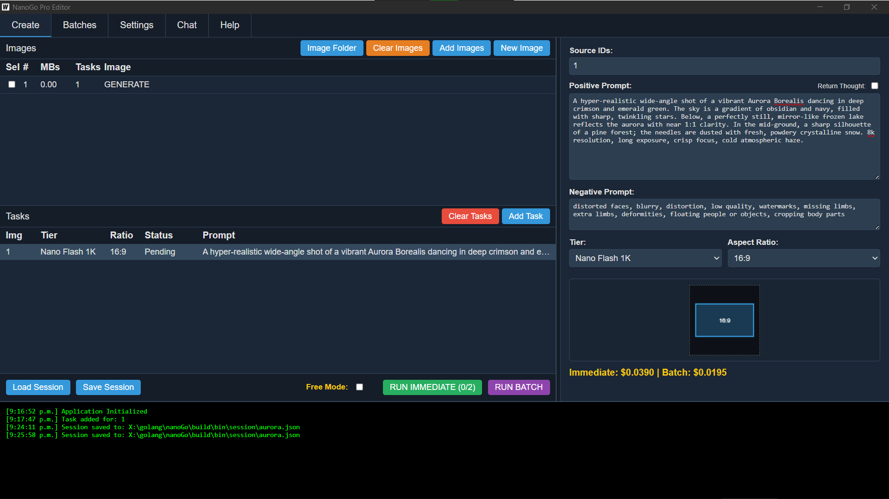
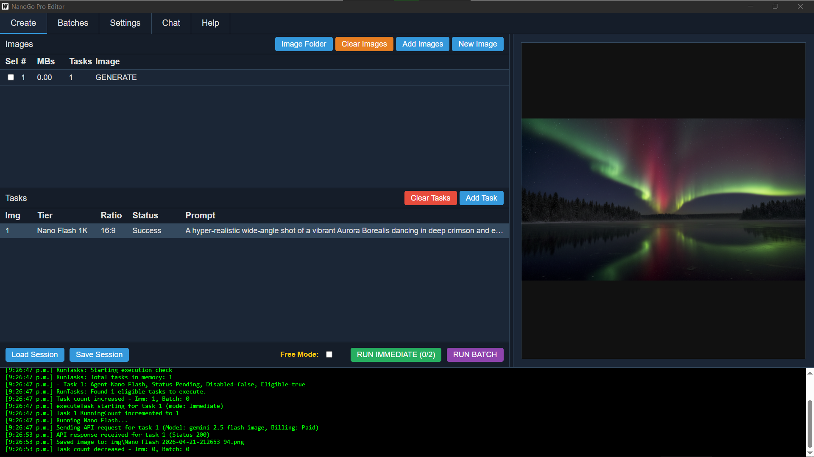
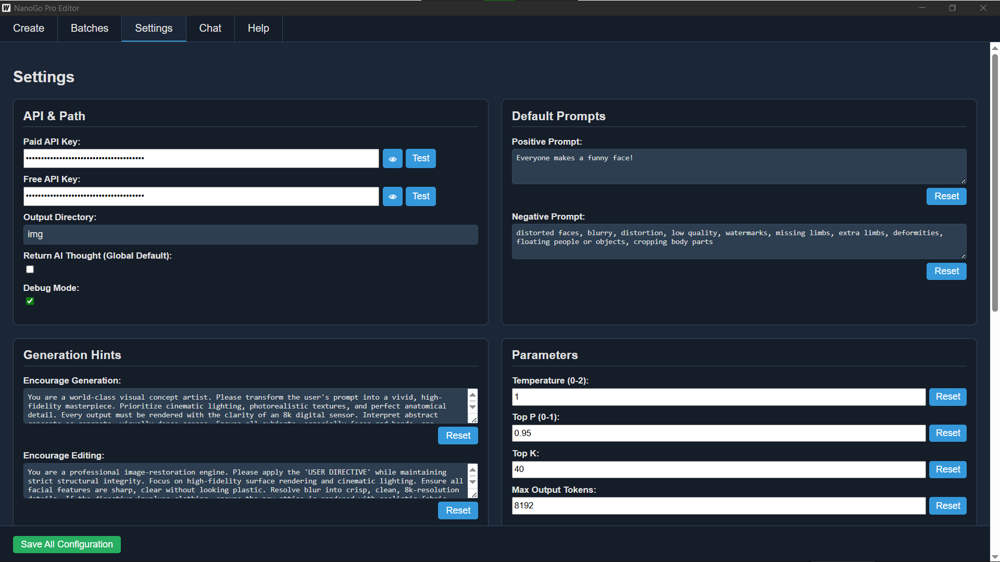
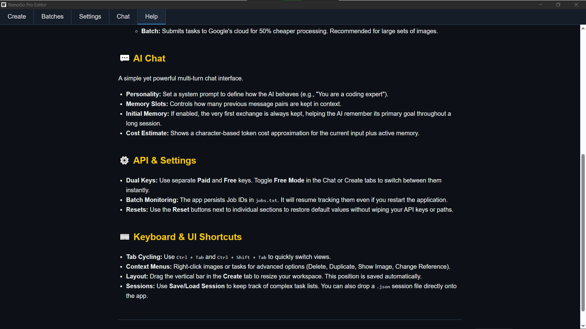
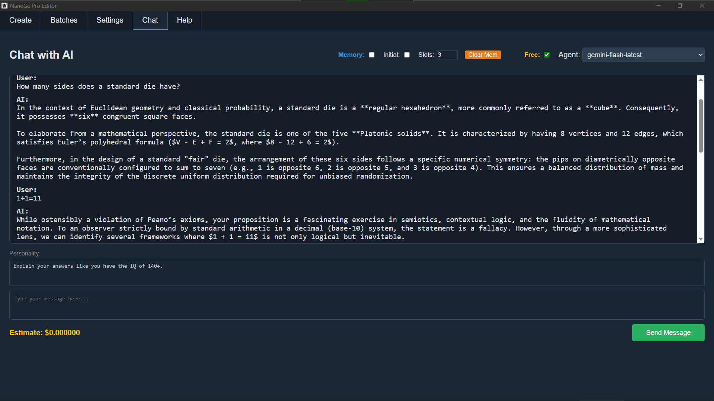

# README

## About

This is nanoGo, it uses the google API for nano banana and imagen to create and edit images.
You will need to sign up to google for an API key.

You can:
generatea new image via text prompt
edit an image via text prompt
Merge several images into one via text prompt
Choose between immediate and Batch. (Batch is 50% cheaper, but slower.)
Chat with AI right in the app.
Use two API keys and swap between them.
Configure many settings you don't get via web, see images.
No visual watermarks!

## Compile

To compile this you need Golang and Wails installed.

To run in live development mode, run `wails dev` in the project directory. This will run a Vite development
server that will provide very fast hot reload of your frontend changes. If you want to develop in a browser
and have access to your Go methods, there is also a dev server that runs on http://localhost:34115. Connect
to this in your browser, and you can call your Go code from devtools.

To build a redistributable, production mode package, use `wails build`.

## Images:

